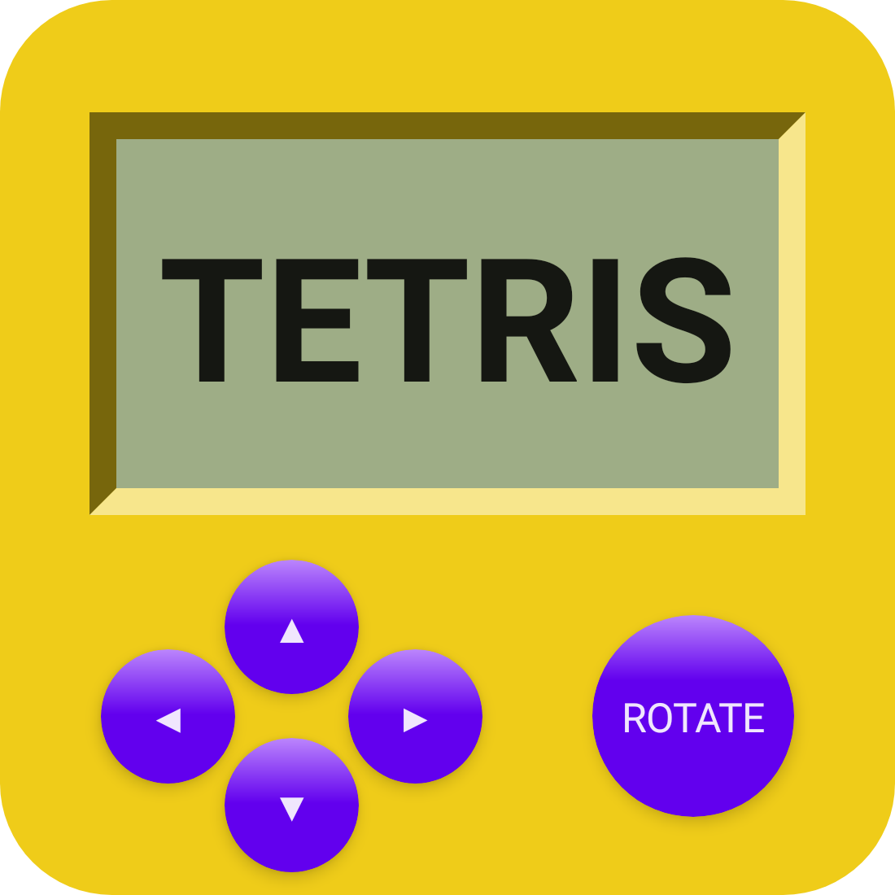

# Compose Tetris

## :scroll: Description

A tetris game fully built using [Jetpack Compose](https://developer.android.com/jetpack/compose), almost all UI elements are created by code, including the following app icon, which is also generated by Composable with @Preview.

- MVI architecture
- Simulate appearance of LCD screen
- Game sound and clock
- Inspired by [react-tetris](https://github.com/chvin/react-tetris/blob/master/README-EN.md)

Download latest APK [here](https://github.com/vitaviva/compose-tetris/actions)

#### Game Rules：
- 100 points for 1 line, 300 points for 2 lines, 700 points for 3 lines, 1500 points for 4 lines;
- The drop speed of the box increases with the number of rows eliminated (one level for every 20 lines);

 

## :nut_and_bolt: MVI Architecture:

 

## :camera_flash: Screenshots
